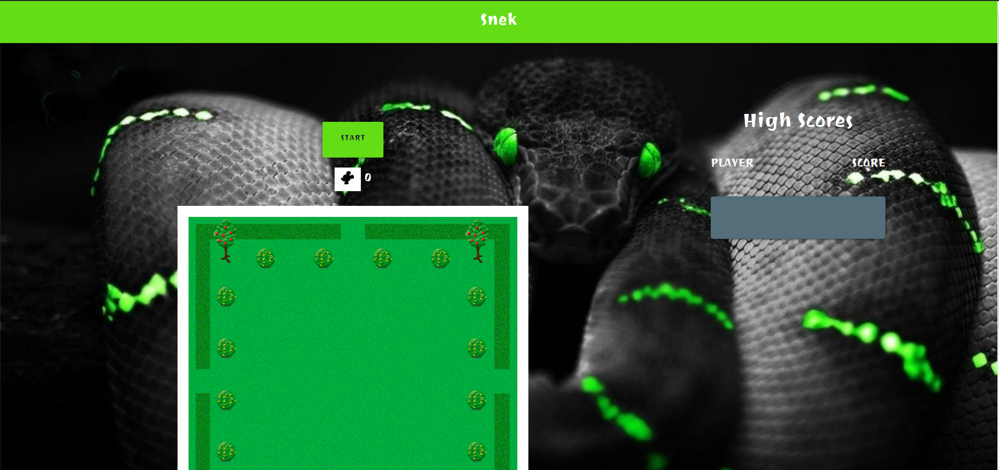

# Snek🐍 - A game based on classic Snake game from the 70's

This application allows the user to play the classic game of snake.

The main objective is to grab the mouse logo that appears in different areas of the game canvas. By doing so, the snake continues to grow by one segment each time the mouse is consumed.

The player moves the body of the snake with the arrow keys, avoiding an obstacle, the borders, and itself.

If the snake collides with the obstacle, the borders, or itself, the game ends.

Then the highscore is recorded and saved.

https://rjhelm.github.io/snek-game/canvas.html

